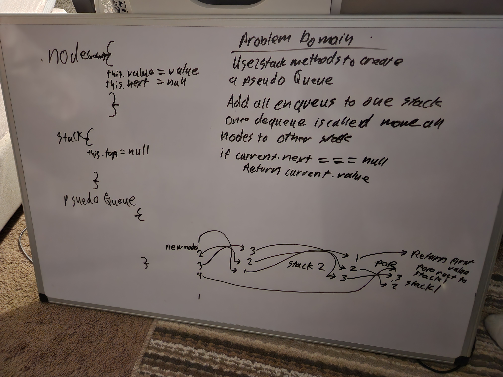

# Data Structures and Algorithms

See [setup instructions](https://codefellows.github.io/setup-guide/code-301/3-code-challenges), in the Code 301 Setup Guide.

## Repository Quick Tour and Usage

### 301 Code Challenges

Under the `javascript` folder, at the top level, is a sub-folder called `code-challenges`

Each day, you'll add one new file to this folder to do your work for the day's assigned code challenge

If you have not already done so, run `npm install` from within this folder to setup your system to be able to run tests using `Jest`

To run your tests

- Change to the `javascript` folder
- run `npm test` to run all of the tests
- run `npm test ##` to only run tests for challenge ## (i.e. 01)

### 401 Data Structures, Code Challenges

### Reverse Array

Reverse an Array in place.

### Whiteboard Process
.png)

### Approach

Created a for loop that lasts the array length. Then shifted the current index, and spliced the index plus one removing the old number.

### insertShiftArray

.png)

### Approach

Having trouble solving this one, waiting for tomorrow for help.

### Binary Search

### WhiteBoard

### Approach

I approached this problem by creating three variables. One for the top range, bottom range, and the middle of the two ranges. Then I created a while loop that will continue until a break is called. If the array at index middle is equal to the search value, then the loop is broken and the index value is returned. If the value at middle index is less than the search value, then the middle value becomes the bottom value. If not then it becomes the top value. continue until the value is found. If not then -1 is returned.

### Stacks and Queues

### Approach

Created a large testing suite to ensure all of the individual challenges were completed to specifications. Running pm test stacksQueses.test.js will show all tests.

### Pseudo Queue

### UML

## Approach

I created two stacks within the queue. Whenever there is an enqueue it is pushed onto one stack. Once a dequeue is called the stack is pushed one at a time into the second stack. From there the first value is popped off and returned. The rest of the values are then pushed one at a time back into the first queue.

### Linked List insertions

### UML

### Approach

Each node is stored as a temp variable. The while loop then checks each of the values as they go. If the values match, the .next is swapped between them and the new node is put in the old ones place.

### Binary Trees

### UML

### Approach

Each Function recursively calls itself to map throughout the entire tree with some helper arrays included in the constructor.

### Animal Shelter queue

### UML

### Approach

I put two separate firsts for the queue to follow. The functions first check what species the animal is, and then implements them into the animal shelter.

### Bracket Validator

### UML

### Approach

I created three separate variables to keep track of whether or not a bracket had a corresponding closing bracket. If there was an opening bracket it one increment by one. If it had a closing bracket it would be decremented by one. At the end the three variables are totaled and if there is any value other than zero the function returns false.

### Max Tree

### UML

### Approach

I created one recursive function to call on inside of the actual max function. That way it could go through the entire tree and return the max value.

### Breadth First Traversal

### UML

### Approach

There is a queue class in addition to the tree class that allows the breadth first traversal to take place. As it dequeues one and adds it to the array, it also enqueues its left and right node.
