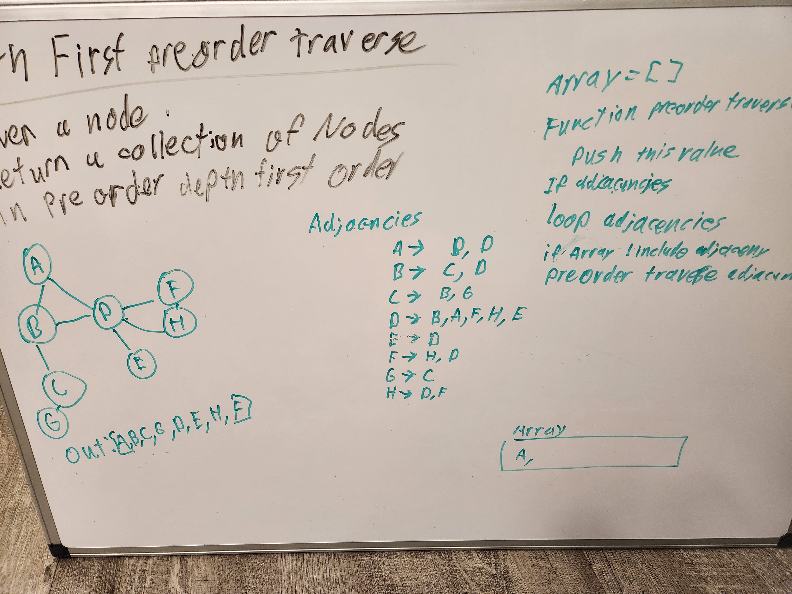

# Graphs

## Challenge 35

I had to add a get nodes, size, and get neighbors method to the graphs class.

## Approach

Most of the methods were solved using the built in methods that come with the Map function. It was a bit of a challenge trying to figure out what the correct syntax was, however once I did it all came together rather quickly.

## Challenge 36  

## Approach  

I solved this problem by looping through the adjacencies array, and returning the unique values into a new array.  

## Challenge 37  

## Approach  

Gave this one a good shot, however I couldn't quite come up with an answer. I think I held myself back with how I structured the vertexes, but I'm not quite sure. Couldn't quite solve the problem of needing to traverse all the adjacencies, but return null if there were no edges. It was giving me a lot of problems, but I think if I just pushed the edges into a new data structure I might have better luck.  

## Challenge 38  

## Approach  

Used the get method on the map class to get the specific node, then looped throught its adjacencies calling a recursive function on each of them. I used an array attached to the graph class because I was having trouble passing in an array to the recursive function and having it persist.  

