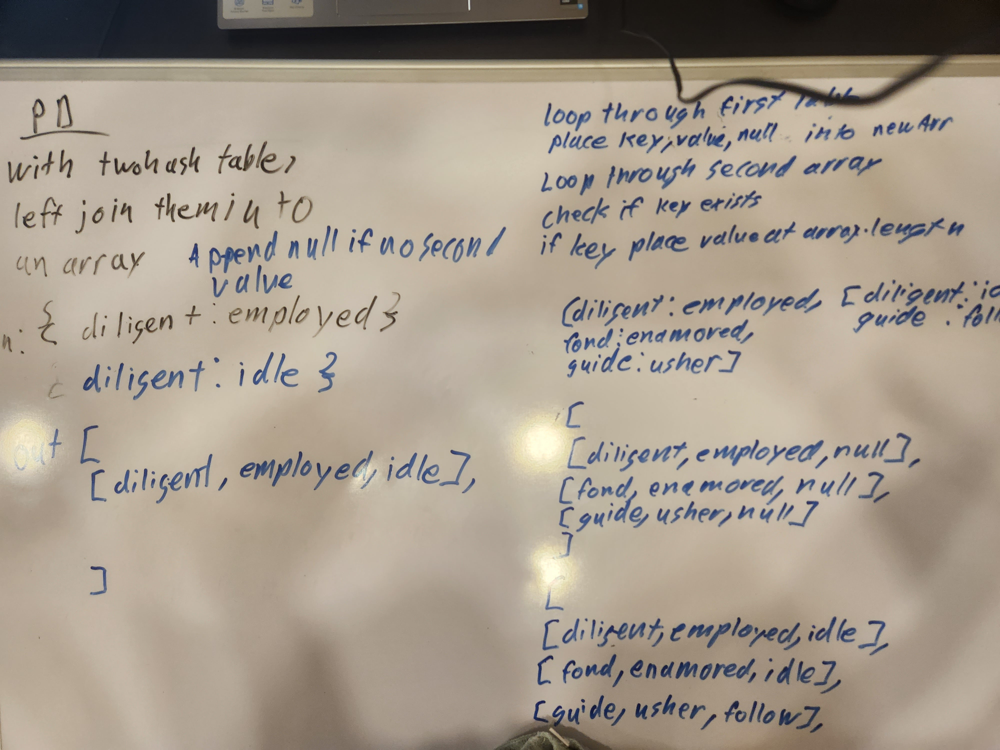

# Hashtables

## Challenge

I needed to create methods that would allow a hash table to set values, retrieve values, return booleans, and return keys from the hashtable. I then had to write tests proving the efficacy of those methods.

## Approach and Efficiency

I used a variety of for loops for all of the methods. Each of these methods has an O(N) for speed. The rest have an O(1) for memory except the has method which is O(n). I had to create a guard if statement for most of them to prevent a runtime error from occuring in the empty values.

## API

The publicly available methods I use were from mozilla docs for the for of loops, and the greater than or equal to method in the Jest documentation.

Mozilla: https://developer.mozilla.org/en-US/docs/Web/JavaScript/Reference/Statements/for...of
Jest: https://jestjs.io/docs/expect

## Challenge

I needed to create a function that detects the first repeated word in a sentence.

## Approach and efficiency

I used a hashmap to keep track of the words being used. The hashmap is as long as the string being used. It then places each unique word into its unique index. If the index position is null, the value is changed to one. If the value is already one, it returns true. Once a true is given by the helper function that string is returned.

## Code Challenge 33

## UML

## Approach

I looped through the first given table put the key and value into a new array. I set the last value in that array as null. Then I pushed that array into a larger overall array to hold all of the results. Then I looped through the second table, and checked if each of those tables keys had a corresponding key in the larger holding array. If it did the last value in that array was set to the value in the second table.

