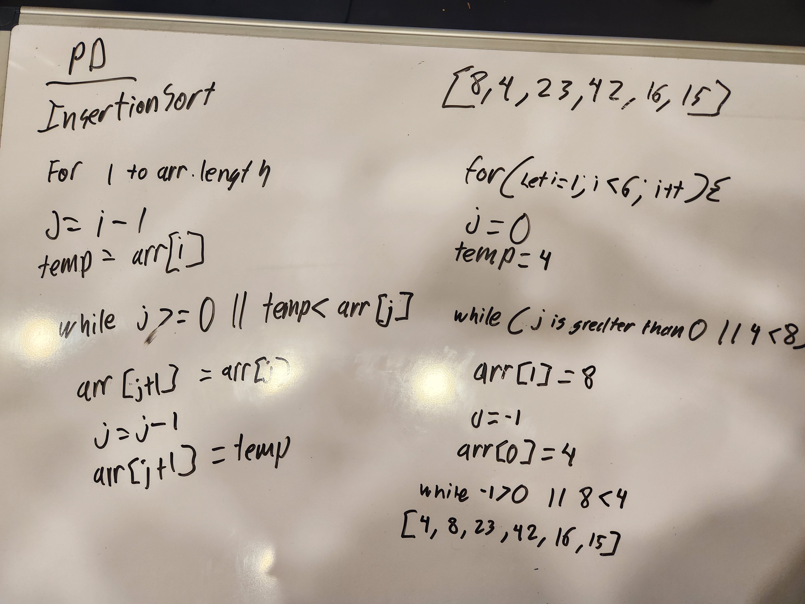
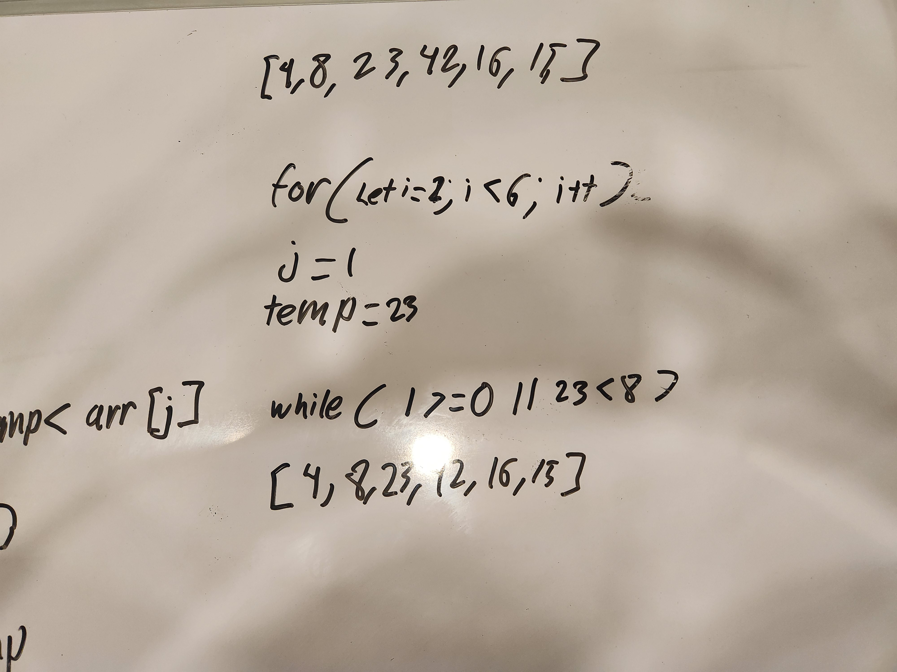
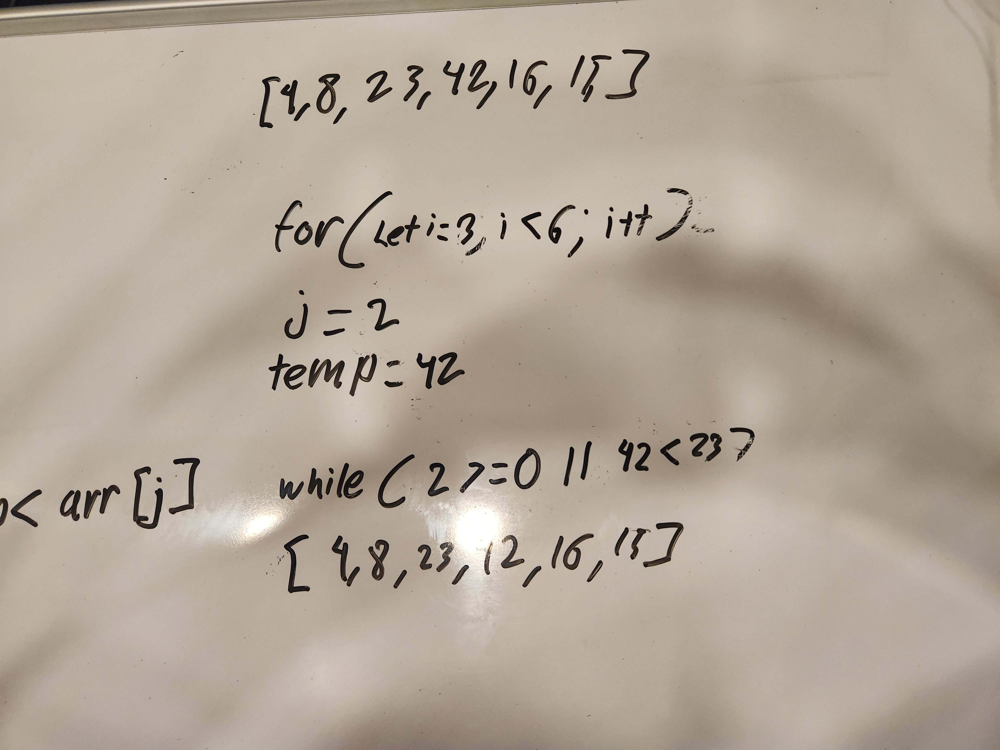
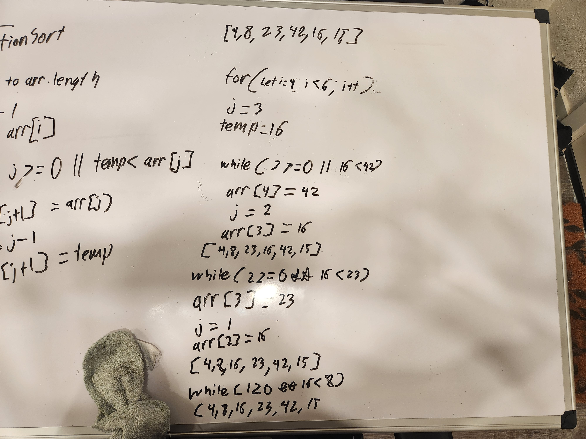

# Blog Notes: Insertion Sort

## Approach

After interpreting the pseudo-code we were provided I stepped through the intial loop like this :

The intial loop sets temp equal to array at index one and determines that the value at index zero is larger. It then switches the two values.

Then for the next two loops the values are sorted properly, so the while loop does not perform its code block.

Finally the loop determines that array at index i is less than the value at index j. The while loop then executes twice to move 16 into the proper position. I didn't step through the final loop however it would perform much the same as this one.
