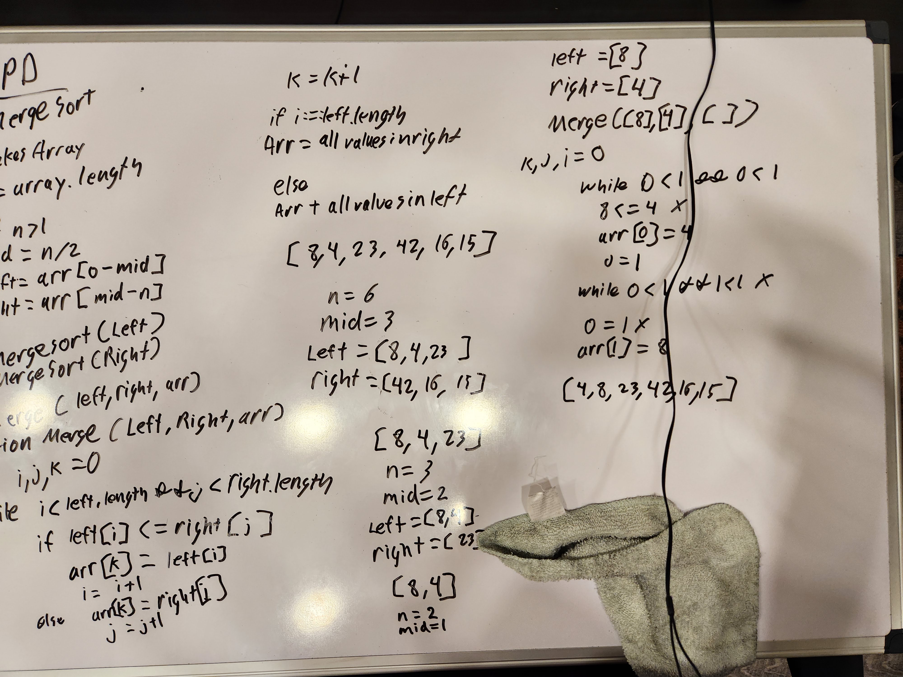
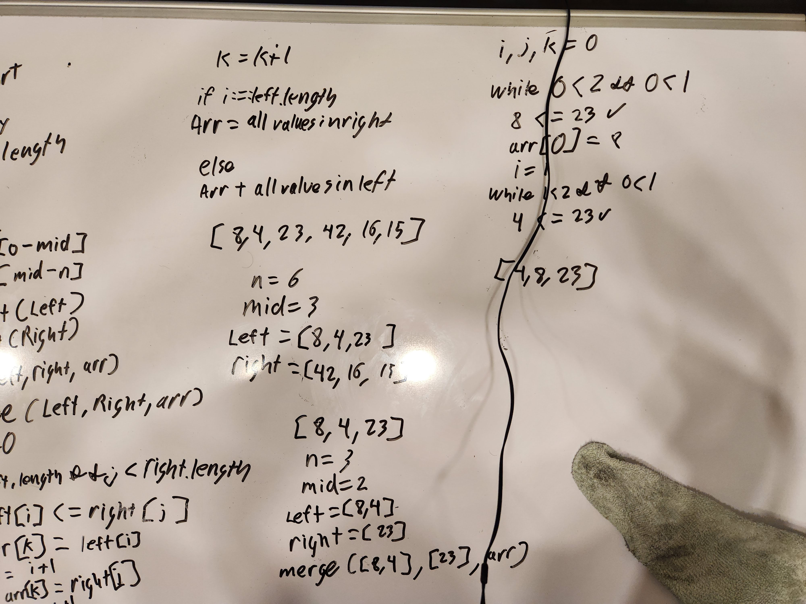

# Blog Notes: Merge Sort

## Approach

After stepping through the function initial I ended up with the original array with the first two numbers switched into their proper order.

During the second iteration I realized that I may have misinterpreted the pseudo code. The input array name used for the first function is the same as what they put in as an argument for the merge function. I am now a bit confused as to whether there is now supposed to be an empty array being inserted or not. If not it makes all the initial iterations useless, but if there should be one, why is it passed in as an argument?
Still a bit confused and going to need to get some clarification.
